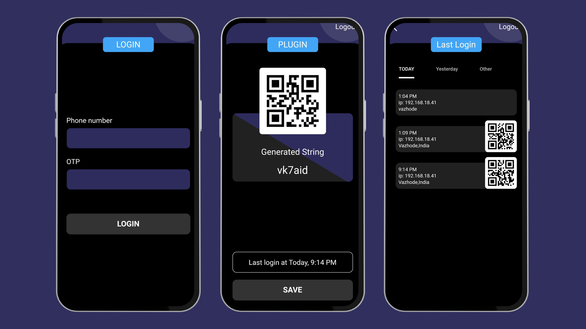

# Secure Connect

The "Secure Connect" Flutter app aims to deliver a secure login experience through phone number authentication, utilizing Firebase Authentication. Post a successful login, the app captures and stores user details, including IP address and location. It generates a unique alphanumeric string with a QR code in the plugin view. The app also offers a history page for users to review their past logins, and it enhances security by prompting biometric authentication upon app relaunch.

